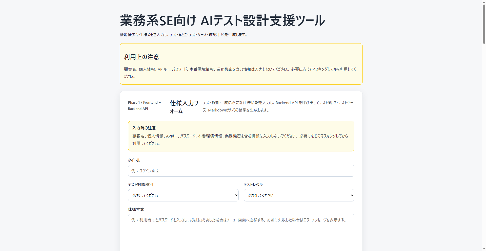
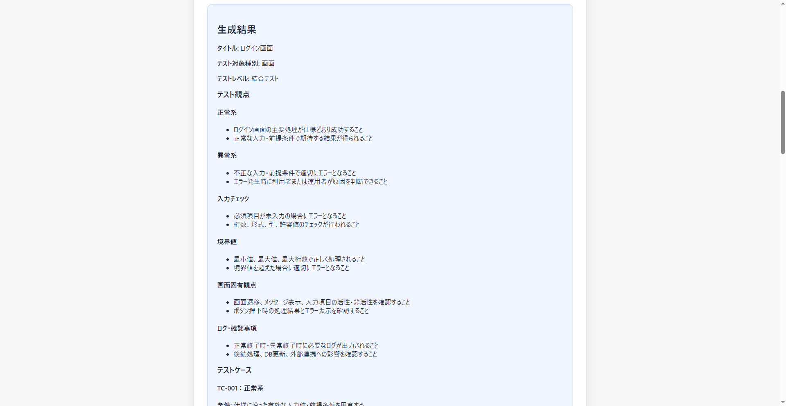
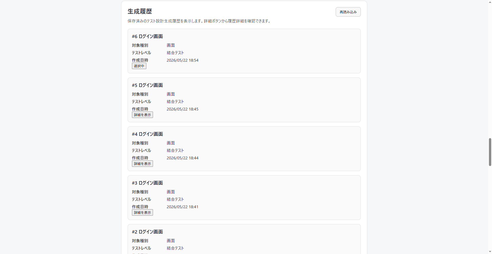
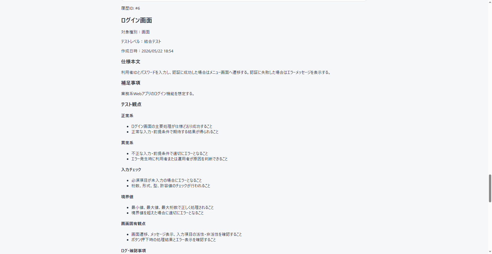

# 業務系SE向け AIテスト設計支援ツール

[](https://github.com/masahironih-hue/ai-test-design-support/actions/workflows/ci.yml)

## 概要

「業務系SE向け AIテスト設計支援ツール」は、機能概要や仕様メモを入力すると、テスト観点・テストケース・確認事項を生成するWebアプリケーションです。

業務系システム開発における、以下のようなテスト設計作業を支援することを目的としています。

- 仕様メモからテスト観点を洗い出す
- 正常系・異常系・境界値などの確認観点を整理する
- テストケース表のたたき台を作成する
- Markdown形式で生成結果をコピーし、設計メモやレビュー資料に転用しやすくする

本アプリは汎用チャットボットではなく、仕様入力からテスト設計出力までの流れに特化した、業務系SE向けのテスト設計支援ツールです。

---

## 開発目的

このプロジェクトは、個人開発のポートフォリオとして、以下を示すことを目的に開発しています。

- Python / FastAPI を用いたBackend API開発
- React / Next.js / TypeScript を用いたFrontend開発
- LLM Mockを利用した業務支援アプリケーション設計
- 業務系システム開発経験を活かしたテスト設計支援の具体化
- AWS SAAの学習内容を、低コストなAWS Serverless構成として実装に落とし込むこと

Phase 1：ローカルMVPでは、仕様入力、LLM Mockによる生成、Markdown表示・コピー、SQLite履歴保存、履歴一覧、履歴詳細まで実装・確認済みです。

Phase 2：AWS低コスト版では、S3 + CloudFront による Frontend静的配信、API Gateway HTTP API + Python Lambda + DynamoDB によるBackend API、CloudFront配信FrontendからAWS Backend APIへの接続まで実装し、画面上で生成・履歴保存・履歴一覧・履歴詳細まで確認済みです。

ただし、現時点ではOpenAI APIやAmazon Bedrockなどの実LLM連携は未実装です。AWS構成も、個人開発向けの低コスト検証構成であり、商用SaaS運用や高可用性構成を目的としたものではありません。

---

## 現在の実装状況

### ローカルMVP

ローカルMVPでは、以下を実装・確認済みです。

```text
Backend：Python / FastAPI
Frontend：Next.js / React / TypeScript
DB：SQLite
LLM：Mock
```

確認済みの範囲は以下です。

- 仕様入力
- LLM Mockによるテスト観点・テストケース生成
- 生成結果表示
- Markdownコピー
- SQLiteへの履歴保存
- 履歴一覧表示
- 履歴詳細表示
- 保存済みMarkdownコピー

### AWS低コスト版

AWS低コスト版では、以下を実装・確認済みです。

```text
Frontend：S3 + CloudFront による静的配信
Backend API：API Gateway HTTP API + Python Lambda
履歴保存：DynamoDB
ログ：CloudWatch Logs
IaC：AWS CDK
```

確認済みの範囲は以下です。

- S3 + CloudFront によるFrontend静的配信
- CloudFront OAC によるS3 private配信
- API Gateway HTTP API + Python Lambda によるBackend API
- DynamoDBによる履歴保存・一覧取得・詳細取得
- CloudFront配信FrontendからAWS Backend APIへの接続
- 画面上での生成・履歴保存・履歴一覧・履歴詳細確認

---

## 主な機能

### ローカルMVP

- 仕様入力フォーム
- テスト対象種別の選択
- テストレベルの選択
- LLM Mockによるテスト観点生成
- テストケース生成
- Markdown形式の生成結果表示
- Markdownコピー
- SQLiteへの履歴保存
- 履歴一覧表示
- 履歴詳細表示
- 保存済みMarkdownコピー
- セキュリティ注意事項表示
- 日時のJST表示

### AWS低コスト版

- AWS CDKによるインフラ管理
- S3 + CloudFront によるFrontend静的配信
- CloudFront OAC によるS3 private配信
- API Gateway HTTP API + Python Lambda によるBackend API
- DynamoDBによる履歴保存・一覧取得・詳細取得
- CloudWatch Logs保持期間7日方針
- CloudFront配信FrontendからAWS Backend APIへの接続

---

## 画面イメージ

Phase 1：ローカルMVPで実装した主要画面です。  
画面キャプチャには、架空のログイン画面仕様をサンプルとして使用しています。

### 仕様入力フォーム

機能概要や仕様メモ、テスト対象種別、テストレベル、補足事項を入力し、テスト設計生成を実行します。



### テスト設計生成結果

入力された仕様をもとに、LLM Mock によりテスト観点、テストケース、Markdown形式の出力を生成します。



### 生成履歴一覧

生成したテスト設計結果はSQLiteに保存され、履歴一覧から確認できます。  
作成日時は画面表示時にJSTへ変換しています。



### 生成履歴詳細

履歴一覧から選択した生成結果の詳細を確認できます。  
保存済みの仕様本文、補足事項、テスト観点、テストケース、Markdown出力を再確認できます。



---

## 技術スタック

### Local MVP

- Python 3.13.x
- FastAPI
- SQLAlchemy
- SQLite
- pytest
- Uvicorn
- Next.js
- React
- TypeScript
- pnpm
- App Router
- LLM Mock

### AWS Low Cost Version

- AWS CDK
- Amazon S3
- Amazon CloudFront
- CloudFront Origin Access Control
- Amazon API Gateway HTTP API
- AWS Lambda
- Amazon DynamoDB
- Amazon CloudWatch Logs

### Development / Management

- Git / GitHub
- GitHub Issues
- GitHub Actions
- README / docs

### Future Candidates

- OpenAI API連携
- Amazon Bedrock連携
- LLM Provider切替
- GitHub Actions

---

## ディレクトリ構成

```text
ai-test-design-support/
├─ backend/
│  ├─ app/
│  ├─ tests/
│  ├─ pyproject.toml
│  └─ README.md
├─ frontend/
│  ├─ src/
│  ├─ package.json
│  ├─ .env.example
│  └─ README.md
├─ infra/
│  ├─ bin/
│  ├─ lib/
│  ├─ package.json
│  └─ cdk.json
├─ docs/
└─ README.md
```

---

## ローカル起動手順

詳細なローカル環境セットアップ手順は、[ローカル開発環境セットアップ](docs/setup-local.md) を参照してください。

### 前提

以下がインストール済みであることを前提とします。

- Python 3.13.x
- Node.js
- pnpm
- Git

---

### Backend起動

```powershell
cd backend
.\.venv\Scripts\Activate.ps1
python -m uvicorn app.main:app --reload
```

起動後、以下にアクセスして疎通確認します。

```text
http://localhost:8000/health
```

---

### Frontend起動

別のPowerShellを開き、以下を実行します。

```powershell
cd frontend
pnpm dev
```

起動後、以下にアクセスします。

```text
http://localhost:3000
```

---

## AWS低コスト版

Phase 2では、AWS低コスト版として、Frontendを S3 + CloudFront で静的配信し、API Gateway HTTP API + Python Lambda + DynamoDB によるBackend APIへ接続する構成を追加しています。

構成概要は以下です。

- Next.js / React / TypeScript Frontend を静的export
- 静的ファイルをS3バケットへ配置
- S3バケットはPublic公開せず、CloudFront OAC経由で配信
- AWS CDKでS3 Bucket、S3 Bucket Policy、CloudFront Distribution、CloudFront OACを管理
- AWS CDKでAPI Gateway HTTP API、Python Lambda、DynamoDB、CloudWatch Logsを管理
- AWS上のBackend APIは `POST /test-designs/generate`、`GET /test-designs/histories`、`GET /test-designs/histories/{history_id}` に対応
- DynamoDBはオンデマンド課金、partition keyは `history_id`
- CloudWatch Logs保持期間は7日
- 既存VPC / EC2 / Security Group / Route 53 は使用・変更しない
- 検証後は `cdk destroy` により本プロジェクト用リソースを削除可能

AWS低コスト版では、CloudFront配信FrontendからAWS Backend APIを呼び出し、画面上で生成・履歴保存・履歴一覧・履歴詳細まで確認済みです。

ただし、本構成は個人開発向けの低コスト検証構成です。OpenAI API連携、Amazon Bedrock連携、Cognito認証、本格API認証、課金、マルチテナント、商用SaaS運用、高可用性構成は未実装です。

READMEには、API Gateway URL、CloudFront DomainName、S3 Bucket名、DynamoDB Table名などの実値を掲載していません。

詳細は以下を参照してください。

- [AWS構成方針](docs/aws-architecture.md)
- [AWSデプロイ手順](docs/aws-deploy.md)
- [AWS削除手順](docs/aws-destroy.md)
- [AWS低コスト構成・料金見積もり](docs/aws-cost-estimate.md)
- [AWS Budgets・コスト制御](docs/aws-budget.md)
- [ローカルMVPとAWS低コスト版の差分](docs/aws-version-differences.md)

---

## AWS版の現在の対応範囲

AWS版では、現時点で以下まで対応しています。

```text
Frontend：S3 + CloudFront で静的配信
Backend API：API Gateway HTTP API + Python Lambda でMock生成API・履歴APIに対応
履歴保存：DynamoDB
画面連携：CloudFront配信FrontendからAWS Backend APIを呼び出し、生成・履歴保存・履歴一覧・履歴詳細まで確認済み
```

AWS版は、AWS SAAで学習した内容を個人開発プロダクトへ低コストなServerless構成として適用したものです。

本番運用、商用SaaS運用、認証、課金、マルチテナント、高可用性構成、実LLM連携は未対応です。

---

## 環境変数

Frontendでは、Backend APIの接続先として以下を使用します。

```text
NEXT_PUBLIC_API_BASE_URL=http://localhost:8000
```

設定例は以下のファイルを参照してください。

```text
frontend/.env.example
```

ローカル開発では、以下のように `.env.local` を作成して使用します。

```text
frontend/.env.local
```

AWS配信用にFrontendをビルドする場合は、AWS Backend APIの接続先を指定します。ただし、API Gateway URLなどの実値はREADMEやdocsへ記載しません。

注意事項：

- `.env.local` はローカル開発用です
- `.env.local` はGit管理対象外です
- APIキー、パスワード、アクセストークンなどの秘密情報をGitHubに上げないでください
- 現時点では外部LLM APIキーは不要です

---

## 操作手順

ローカル環境での基本操作手順は以下です。

1. Backendを起動する
2. Frontendを起動する
3. ブラウザで `http://localhost:3000` を開く
4. 仕様入力フォームに架空サンプル仕様を入力する
5. テスト対象種別を選択する
6. テストレベルを選択する
7. テスト設計を生成する
8. 生成結果を確認する
9. Markdownをコピーする
10. 履歴一覧を確認する
11. 履歴詳細を確認する
12. 保存済みMarkdownをコピーする

AWS版のデプロイ・確認手順は、[AWSデプロイ手順](docs/aws-deploy.md) を参照してください。

---

## サンプル入力

以下は動作確認用の架空サンプルです。  
実案件の仕様、顧客情報、個人情報、業務機密は使用しないでください。

```text
タイトル：
ログイン画面

テスト対象種別：
画面

テストレベル：
結合テスト

仕様本文：
利用者IDとパスワードを入力し、認証に成功した場合はメニュー画面へ遷移する。
認証に失敗した場合はエラーメッセージを表示する。

補足事項：
業務系Webアプリのログイン機能を想定する。
```

---

## テスト・確認コマンド

ローカル環境では、以下のコマンドでCI相当の確認を行えます。

### Backend

```powershell
cd backend
python -m pytest
```

### Frontend

```powershell
cd frontend
pnpm lint
pnpm build
```

### Infra

```powershell
cd infra
pnpm cdk synth
```

`pnpm cdk synth` はCDKテンプレートの合成確認のみを行います。AWSリソースの作成・更新・削除は行いません。

## CI

本リポジトリでは、GitHub Actions により以下を自動確認しています。

```text
Backend pytest
Frontend lint
Frontend build
Infra cdk synth
```

CIは品質確認を目的としたものであり、AWS deploy は自動化していません。

GitHub Actionsでは、AWS認証情報、GitHub Secrets、OIDC連携を使用せず、`cdk deploy`、`cdk destroy`、AWSリソースの作成・更新・削除は実行しません。

AWSリソースの作成・削除は、ローカル環境から手動で確認する前提です。手順は以下を参照してください。

- [AWSデプロイ手順](docs/aws-deploy.md)
- [AWS削除手順](docs/aws-destroy.md)

## セキュリティ・守秘義務上の注意

本アプリの利用時は、以下の情報を入力しないでください。

```text
顧客名、個人情報、APIキー、パスワード、本番環境情報、業務機密を含む情報は入力しないでください。
必要に応じてマスキングしてから利用してください。
```

開発・動作確認では、以下を徹底します。

- 本業の顧客情報は使用しない
- 実案件の設計書、実コード、実ログは使用しない
- 個人情報は使用しない
- サンプル仕様は架空データのみ使用する
- `.env` / `.env.local` / SQLite DBファイルはGit管理対象外にする
- APIキー、パスワード、アクセストークンをGitHubに上げない
- API Gateway URL、CloudFront DomainName、S3 Bucket名、DynamoDB Table名などのAWSリソース実値をREADME / docsへ記載しない

---

## 現時点の制約

現時点では、以下の制約があります。

### AI / LLM

- LLM Mockを使用しており、実際の外部LLM APIは呼び出していない
- OpenAI API連携は未実装
- Amazon Bedrock連携は未実装
- LLM Provider切替は未実装
- プロンプトテンプレート管理は未実装
- 生成根拠表示は未実装

### 認証・利用者管理

- Cognito認証は未実装
- API認証は未実装
- マルチテナントは未実装
- 課金は未実装

### 業務アプリ機能

- 履歴検索・編集・削除は未実装
- ファイルアップロードは未実装
- Excel出力は未実装
- Markdownレンダリングライブラリは未導入
- 本格ページネーションは未実装
- RAGは未実装

### AWS運用

- 独自ドメインは未設定
- 商用SaaS運用は未対応
- 高可用性構成は未対応
- WAF、ALB、RDS、ECS Fargate、NAT Gatewayは初期構成では使用していない
- 検証用リソースは必要に応じて削除する前提
- 常時公開URLはREADMEに掲載していない

初期段階では、機能を広げすぎず、まずは「仕様入力 → 生成 → 表示 → 保存 → 履歴確認」まで動くことと、個人開発として継続しやすい低コスト構成でAWS化することを優先しています。

---

## 今後の改善候補

### AI / LLM 強化

- OpenAI API連携
- Amazon Bedrock対応
- LLM Provider切替
- プロンプトテンプレート管理
- LLM利用回数制限
- 生成根拠表示

### AWS展開

- AWS構成図の追加
- GitHub Actionsによるデプロイ自動化検討
- DynamoDB履歴の検索・削除・TTL検討
- API認証方式の検討
- 独自ドメイン適用の検討

### 業務アプリ機能強化

- 画面キャプチャ追加
- Excel出力
- ファイルアップロード
- 履歴検索 / 編集 / 削除
- Markdown表示改善
- 面談用説明文・スキルシート反映

---

## GitHub Releases

| Version | 内容 |
|---|---|
| `v0.1.0-local-mvp` | ローカルMVP。仕様入力、LLM Mock生成、SQLite履歴保存、履歴一覧・詳細まで確認 |
| `v0.2.0-aws-frontend-hosting` | S3 + CloudFrontによるFrontend静的配信 |
| `v0.3.0-aws-low-cost-version` | S3 + CloudFront、API Gateway HTTP API、Python Lambda、DynamoDBを使ったAWS低コスト版 |

---

## 関連docs

詳細な設計・検討内容は以下を参照してください。

- [ローカル開発環境セットアップ](docs/setup-local.md)
- [MVP要件整理](docs/mvp-requirements.md)
- [API設計](docs/api-design.md)
- [DB設計](docs/db-design.md)
- [LLM Mock設計](docs/llm-mock-design.md)
- [画面設計](docs/screen-design.md)
- [Markdown出力設計](docs/markdown-output.md)
- [サンプル仕様](docs/sample-specs.md)
- [Phase 1 実装前チェックリスト](docs/phase1-implementation-checklist.md)
- [ローカルMVP総合動作確認](docs/local-mvp-verification.md)
- [AWS構成方針](docs/aws-architecture.md)
- [AWS低コスト構成・料金見積もり](docs/aws-cost-estimate.md)
- [AWSデプロイ手順](docs/aws-deploy.md)
- [AWS削除手順](docs/aws-destroy.md)
- [AWS Budgets・コスト制御](docs/aws-budget.md)
- [ローカルMVPとAWS低コスト版の差分](docs/aws-version-differences.md)
